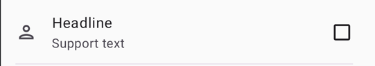

# Material Lists

[](https://s01.oss.sonatype.org/content/repositories/releases/net/nicbell/material-lists/listitem/)
[](https://codecov.io/gh/nicbell/material-lists)

An Android XML implementation of Material 3 list items.


## 🙋🏽 Why

Material lists are available in Jetpack Compose but were never implemented in XML. This is a tiny
library that aims to provide most examples of this component specified in
the [design documentation](https://m3.material.io/components/lists/specs).

I have had to re-implement this layout so many times that I have decided to open-source it.

## 🪜 Setup

Include the dependency in your project.

```groovy
implementation "net.nicbell.material-lists:listitem:x.x.x"
```

In order to download the dependency please make sure access to the maven repo is configured. 
You probably already have Maven Central configured; if you don't you will need to add it.

```gradle
repositories {
    //..
    mavenCentral()
}
```

## 🏄🏽 Usage

Add the `ListItem` component to your layout.

### Attributes

The following attributes can be changed for a `ListItem`.

| Description                 | Relevant attributes |
|-----------------------------|---------------------|
| Headline text               | `app:head`          |
| Supporting text             | `app:supportText`   |
| Size type - 1, 2 or 3 lines | `app:sizeType`      |

For more info about size types see
the [design documentation](https://m3.material.io/components/lists/specs).

### Content

Leading and trailing content can be added as child views. A content style is require in order to
position the content correctly within the `ListItem`.

| Description              | Style                                  | Required view type                   |
|--------------------------|----------------------------------------|--------------------------------------|
| Leading icon             | `MaterialLists.LeadingIcon`            | `AppCompatImageView`                 |
| Leading image            | `MaterialLists.LeadingImage`           | `AppCompatImageView`                 |
| Leading video thumbnail  | `MaterialLists.LeadingVideoThumbnail`  | `AppCompatImageView`                 |
| Leading avatar image     | `MaterialLists.LeadingAvatar`          | `ShapeableImageView`                 |
| Leading avatar label     | `MaterialLists.LeadingAvatarLabelText` | `MaterialTextView`                   |
| Leading checkbox         | `MaterialLists.LeadingCheckbox`        | `MaterialCheckBox`                   |
| Leading radio button     | `MaterialLists.LeadingRadioButton`     | `MaterialRadioButton`                |
| Trailing icon            | `MaterialLists.TrailingIcon`           | `AppCompatImageView`                 |
| Trailing checkbox        | `MaterialLists.TrailingCheckbox`       | `MaterialCheckBox`                   |
| Trailing radio button    | `MaterialLists.TrailingRadioButton`    | `MaterialRadioButton`                |
| Trailing switch          | `MaterialLists.TrailingSwitch`         | `SwitchMaterial` or `MaterialSwitch` |
| Trailing supporting text | `MaterialLists.TrailingSupportingText` | `MaterialTextView`                   |

### Example

```xml

<net.nicbell.materiallists.ListItem 
    android:layout_width="match_parent"
    android:layout_height="wrap_content" 
    app:headline="Headline" 
    app:sizeType="TWO_LINES"
    app:supportText="Support text">

    <androidx.appcompat.widget.AppCompatImageView 
        style="@style/MaterialLists.LeadingIcon"
        android:layout_width="wrap_content" 
        android:layout_height="wrap_content"
        android:src="@drawable/ic_outline_person_24" />

    <com.google.android.material.checkbox.MaterialCheckBox
        style="@style/MaterialLists.TrailingCheckbox" 
        android:layout_width="wrap_content"
        android:layout_height="wrap_content" />
</net.nicbell.materiallists.ListItem>
```

Which will output the following.



### Material 2 compatibility

This library was designed to work with `Theme.Material3` themes or themes inheriting from those
themes. The reason for this, is that the library leverages some tokens that are only available in
Material 3. If your activities use `Theme.MaterialComponents` themes you can still use the library
but you will need to apply a `Theme.Material3` theme to the `ListItem` or one of it's parents in your
layout.

### Demo

There is a demo app included with many examples.


